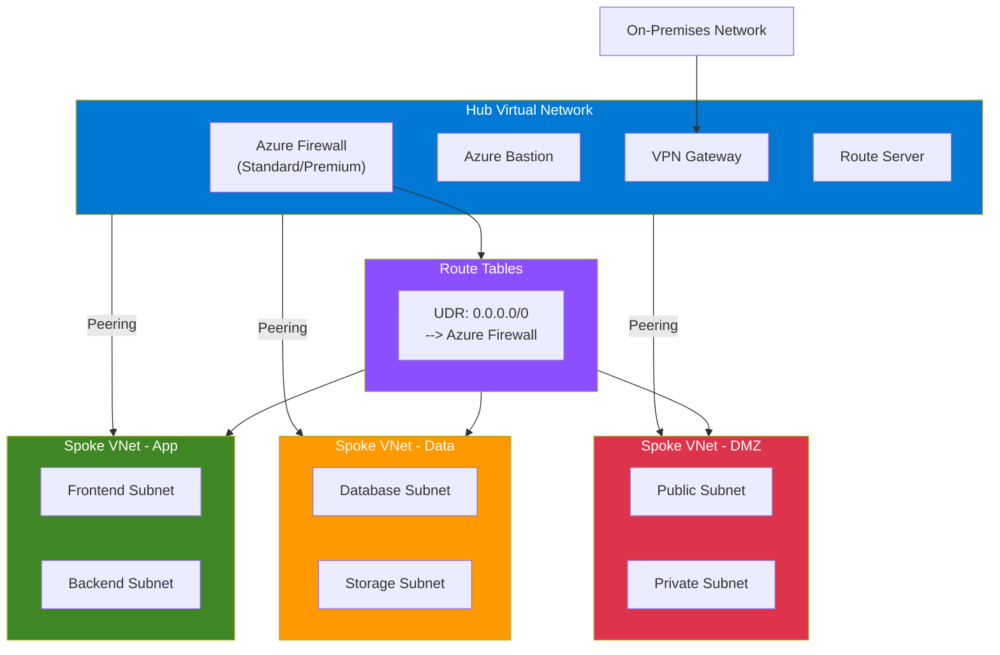

# Terraform Azure Hub-Spoke Network

Deploys a hub-and-spoke network topology on Azure with Azure Firewall, Bastion, VPN Gateway, ExpressRoute, and Route Server.

## Architecture



### ASCII Diagram

```
                        ┌─────────────────────────────────────────────┐
                        │              Hub Virtual Network            │
                        │                                             │
                        │  ┌─────────────────┐  ┌─────────────────┐  │
     On-Premises ───────┤  │  VPN Gateway /   │  │  Azure Bastion  │  │
     Network            │  │  ExpressRoute GW │  │                 │  │
                        │  └─────────────────┘  └─────────────────┘  │
                        │                                             │
                        │  ┌─────────────────┐  ┌─────────────────┐  │
                        │  │  Azure Firewall  │  │  Route Server   │  │
                        │  │  (Premium/Std)   │  │                 │  │
                        │  │  + IDPS          │  │                 │  │
                        │  │  + DNS Proxy     │  │                 │  │
                        │  └────────┬────────┘  └─────────────────┘  │
                        │           │                                 │
                        └───────────┼─────────────────────────────────┘
                                    │
                     ┌──────────────┼──────────────┐
                     │              │              │
              ┌──────┴──────┐ ┌────┴────┐  ┌──────┴──────┐
              │  Spoke VNet │ │  Spoke  │  │  Spoke VNet │
              │  (App)      │ │  VNet   │  │  (DMZ)      │
              │             │ │ (Data)  │  │             │
              │ ┌─────────┐ │ │┌──────┐ │  │ ┌─────────┐ │
              │ │Frontend │ │ ││  DB  │ │  │ │ Public  │ │
              │ ├─────────┤ │ │├──────┤ │  │ ├─────────┤ │
              │ │Backend  │ │ ││Store │ │  │ │ Private │ │
              │ └─────────┘ │ │└──────┘ │  │ └─────────┘ │
              └─────────────┘ └─────────┘  └─────────────┘

              ◄── UDR: 0.0.0.0/0 → Azure Firewall ──►
```

## Features

- **Hub Virtual Network** with reserved subnets (AzureFirewallSubnet, GatewaySubnet, AzureBastionSubnet, RouteServerSubnet)
- **Azure Firewall** (Standard or Premium) with firewall policy, IDPS, DNS proxy, and configurable rule collection groups
- **Azure Bastion** (Basic or Standard SKU) for secure VM access
- **VPN Gateway** for site-to-site and point-to-site VPN connectivity
- **ExpressRoute Gateway** for private connectivity to on-premises
- **Azure Route Server** for dynamic route exchange with NVAs
- **Spoke Virtual Networks** with automatic hub peering and optional UDR routing through the firewall
- **Diagnostic Settings** with Log Analytics workspace integration
- **User-Defined Routes (UDRs)** automatically applied to spoke subnets that route through the firewall

## Usage

```hcl
module "hub_spoke" {
  source = "github.com/kogunlowo123/terraform-azure-hub-spoke-network"

  name_prefix            = "myproject"
  resource_group_name    = "rg-networking"
  location               = "East US"
  hub_vnet_address_space = ["10.0.0.0/16"]

  spoke_vnets = {
    workload = {
      address_space = ["10.1.0.0/16"]
      subnets = {
        default = {
          address_prefixes = ["10.1.0.0/24"]
        }
      }
      route_through_firewall = true
    }
  }

  enable_firewall    = true
  enable_bastion     = true
  enable_vpn_gateway = false

  tags = {
    Environment = "production"
  }
}
```

## Requirements

| Name | Version |
|------|---------|
| terraform | >= 1.5.0 |
| azurerm | >= 3.80.0 |

## Inputs

| Name | Description | Type | Default |
|------|-------------|------|---------|
| name_prefix | Prefix for all resource names | string | n/a |
| resource_group_name | Resource group name | string | n/a |
| location | Azure region | string | n/a |
| hub_vnet_address_space | Hub VNet address space | list(string) | n/a |
| hub_subnets | Additional hub subnets | map(object) | `{}` |
| spoke_vnets | Spoke VNets with subnets and firewall routing | map(object) | `{}` |
| enable_firewall | Deploy Azure Firewall | bool | `true` |
| firewall_sku_tier | Firewall SKU tier | string | `"Premium"` |
| firewall_threat_intel_mode | Threat intelligence mode | string | `"Deny"` |
| firewall_policy_rule_collection_groups | Firewall policy rule collection groups | list(object) | `[]` |
| enable_bastion | Deploy Azure Bastion | bool | `true` |
| bastion_sku | Bastion SKU | string | `"Standard"` |
| enable_vpn_gateway | Deploy VPN Gateway | bool | `false` |
| vpn_gateway_sku | VPN Gateway SKU | string | `"VpnGw1"` |
| vpn_gateway_type | VPN Gateway type | string | `"Vpn"` |
| enable_expressroute | Deploy ExpressRoute Gateway | bool | `false` |
| expressroute_sku | ExpressRoute Gateway SKU | string | `"Standard"` |
| enable_route_server | Deploy Azure Route Server | bool | `false` |
| enable_dns_proxy | Enable DNS proxy on firewall policy | bool | `true` |
| log_analytics_workspace_id | Log Analytics workspace ID | string | `null` |
| tags | Tags for all resources | map(string) | `{}` |

## Outputs

| Name | Description |
|------|-------------|
| hub_vnet_id | Hub virtual network ID |
| hub_vnet_name | Hub virtual network name |
| hub_subnet_ids | Map of hub subnet IDs |
| spoke_vnet_ids | Map of spoke VNet IDs |
| spoke_vnet_names | Map of spoke VNet names |
| spoke_subnet_ids | Map of spoke subnet IDs |
| firewall_id | Azure Firewall ID |
| firewall_private_ip | Azure Firewall private IP |
| firewall_public_ip | Azure Firewall public IP |
| firewall_policy_id | Azure Firewall Policy ID |
| bastion_id | Azure Bastion Host ID |
| bastion_dns_name | Azure Bastion DNS name |
| vpn_gateway_id | VPN Gateway ID |
| vpn_gateway_public_ip | VPN Gateway public IP |
| expressroute_gateway_id | ExpressRoute Gateway ID |
| route_server_id | Azure Route Server ID |
| spoke_route_table_ids | Spoke route table IDs |

## Examples

- [Basic](./examples/basic/) - Hub with firewall, bastion, and a single spoke
- [Advanced](./examples/advanced/) - Multiple spokes, VPN Gateway, firewall rules, and diagnostics
- [Complete](./examples/complete/) - All features enabled including ExpressRoute and Route Server

## License

MIT License - see [LICENSE](LICENSE) for details.
